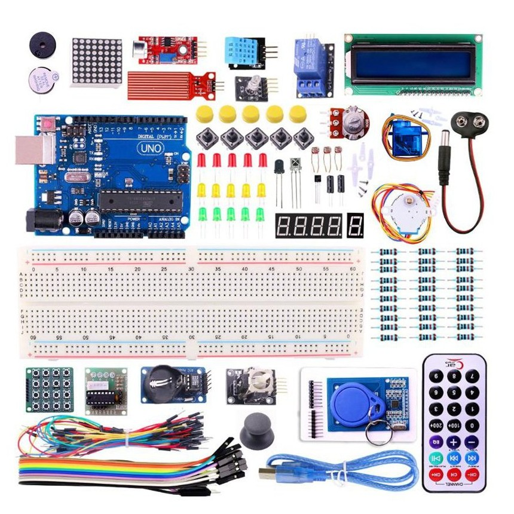

> **ວຽກບ້ານ**
> ອິງຕາມອຸປະກອນທີ່ list ໃຫ້ລຸ່ມນີ້ (40 items)
> 1. ໃຫ້ອະທິບາຍອຸປະກອນແຕ່ລະອັນແມ່ນຫຍັງ? 
> 2. ການໃຊ້ງານຂອງອຸປະກອນແຕ່ລະອັນເຮັດວຽກແນວໃດ?
> 3. ໃນຫົວຂໍ້ອຸປະກອນຈະຕ້ອງປະກອບມີ: 
> 	- ຊື່ອຸປະກອນ
> 	- ຮູບພາບອຸປະກອນຕົວຈິງ
> 	- ຮູບອຸປະກອນແບບ Schematic Diagram ຫລື PINOUT Guide ພ້ອມອະທິບາຍແຕ່ລະພາກສ່ວນ
> 	- etc..
> 4. ໃຫ້ຫົວຂໍ້ຕົວຢ່າງການນຳໃຊ້ອຸປະກອນນັ້ນ
> 
---

### ✅ **Arduino Starter Kit Numbered Checklist**

#### 🔌 Core Boards & Interfaces

1. [ ] Arduino Uno board
2. [ ] Breadboards
3. [ ] USB cable

#### 🧵 Wiring & Connectors

4. [ ] Jumper wires (male-to-male)
5. [ ] Jumper wires (male-to-female)
6. [ ] Jumper wires (female-to-female)
7. [ ] 9V Battery Connector

#### 💡 Basic Components

8. [ ] LEDs (Red: 5, Yellow: 5, Blue: 5, RGB: 1)
9. [ ] RGB module
10. [ ] Resistors (220Ω, 1kΩ, 10kΩ)
11. [ ] Push Buttons (x4 with Lids )
12. [ ] Potentiometer (5kΩ)
13. [ ] Active Buzzer
14. [ ] Passive Buzzer

#### 📟 Displays & Output

15. [ ] 16x2 LCD display 
16. [ ] I2C Serial Adapter board module
17. [ ] 7-segment display (Common Cathode +)
18. [ ] 4-Digit 7-Segment Display
19. [ ] 8x8 Dot Matrix display

#### 📡 Sensors & Input Modules

20. [ ] Temperature and humidity sensor (DHT11)
21. [ ] LM35 Temperature Sensor
22. [ ] Tilt sensor (x2)
23. [ ] Photoresistor (LDRs x3)
24. [ ] PIR sensor
25. [ ] Ultrasonic module
26. [ ] Sound sensor
27. [ ] Water sensor
28. [ ] Flame sensor
29. [ ] RFID module
30. [ ] RFID tag
31. [ ] Infrared receiver

#### 🎮 Remote & Control

32. [ ] Infrared remote control
33. [ ] Joystick module
34. [ ] 4x4 Matrix Keyboard Module
35. [ ] Relay module

#### ⚙️ Motors & Drivers

36. [ ] Servo motor
37. [ ] Stepper motor
38. [ ] Stepper motor driver board

#### 🧠 ICs & Modules

39. [ ] Real-time Clock Module DS1302 
40. [ ] 74HC595 Chip

---
